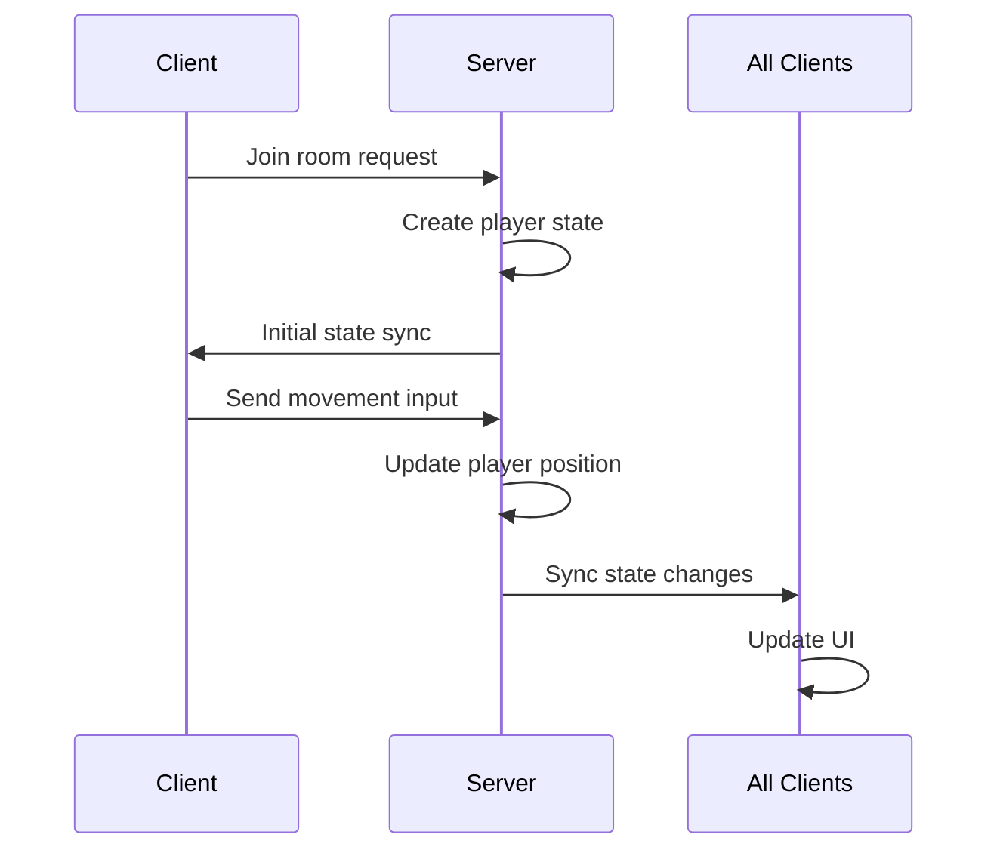

This is a comprehensive example of a Colyseus multiplayer game server. Let me break down the key components and how they work together:

1. **Server Setup (app.config.ts)**:
- Initializes the game server and defines different room types
- Sets up Express middleware for authentication, playground, and monitoring
- Configures static file serving

2. **Room Types**:

a) **ChatRoom (01-chat-room.ts)**:
- Simple room for broadcasting messages between clients
- Handles join/leave events and message broadcasting

b) **StateHandlerRoom (02-state-handler.ts)**:
- Demonstrates state synchronization between server and clients
- Uses Schema for defining the game state structure
- Handles player movement and position updates

c) **AuthRoom (03-auth.ts)**:
- Shows Facebook authentication integration
- Validates access tokens before allowing room access

d) **ReconnectionRoom (04-reconnection.ts)**:
- Demonstrates client reconnection functionality
- Allows players to rejoin after disconnection

e) **LobbyRoom and CustomLobbyRoom**:
- Built-in and custom lobby implementations
- Tracks available rooms and their states

3. **Client-Side Implementation**:
- HTML files contain client-side code using colyseus.js
- Connects to server using WebSocket
- Handles UI updates based on server state changes
- Sends player inputs to server

4. **Data Flow Example** (using StateHandlerRoom):



5. **Key Features**:
- Real-time synchronization
- State management
- Authentication
- Reconnection handling
- Room management
- Message broadcasting

To run this:

1. Start the server:
```bash
npm start
```

2. Access different demos through browser:
- Chat: http://localhost:2567/01-chat.html
- State Handler: http://localhost:2567/02-state-handler.html
- etc.

The server uses Colyseus framework which handles:
- WebSocket connections
- State synchronization
- Room management
- Client message handling
- Authentication

This provides a foundation for building real-time multiplayer games and applications.
